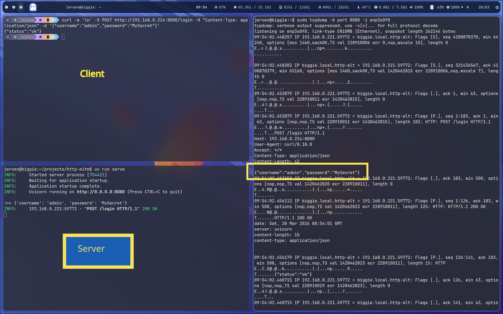

# Smallest webserver to support HTTP POST

## Introduction

Used for an http-vs-https intercept demo.

 

## ssl

generate a self-signed certificate and run `uv run serve-ssl` instead

```bash
openssl req -x509 -newkey rsa:2048 -keyout key.pem -out cert.pem -days 365 -nodes -subj '/CN=localhost'
```

